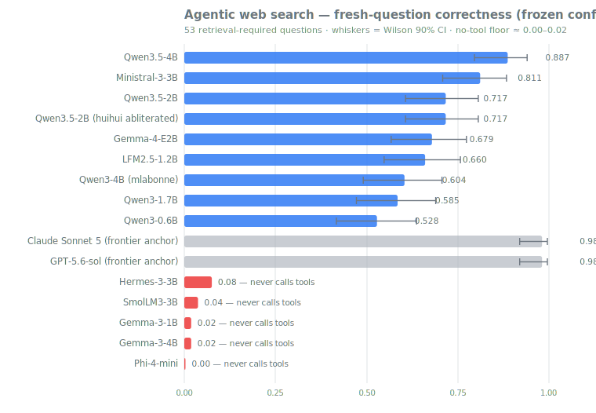

# ferret-bench 🦡→🔎

**Agentic web-search benchmark for small on-device LLMs** — which configuration (result count, prompts, formatting, provider, search→read policy) and which <8B model give the best model-driven internet search experience. Built for [PocketPal AI](https://github.com/a-ghorbani/pocketpal-ai) (PR #808: `web_search` + `read_url` talents, BYOK), app-agnostic by design: the harness is a faithful replica of PocketPal's OpenAI tool-calling ReAct loop (`harness/CONTRACT.md` pins the contract verbatim).

> Ferrets are small and relentless at finding things. So should your pocket LLM be.

- **`frozen-config/`** — the optimized configuration PocketPal can consume directly (tool definitions, prompt, formatting, provider), every value annotated with the runs that justified it (`PROVENANCE.md`).
- **`report.md`** — findings for all research questions; **`analysis/leaderboard.md`** — the model ranking.
- **`PROTOCOL.md`** — the full experimental protocol with amendment log; **`JOURNAL.md`** — decision log.

## Results at a glance (dataset **v2**, anchored 2026-07-12)



Four things this benchmark establishes (full statistics in [`report.md`](report.md); machine-readable in [`analysis/scores.jsonl`](analysis/scores.jsonl)):

1. **Small models are frontier-grade at everyday lookups, and fall away on hard retrieval.** This is the headline. On questions whose answer sits in the search results (T1), Ministral-3-3B scores 1.00 and Qwen3.5-4B 0.95 — level with Claude Sonnet 5 and GPT-5.6 run through the identical loop. On questions needing several sources or a dependent second search (T3+T4), the frontier models do not degrade at all, while Ministral drops to 0.67 and Qwen3-1.7B to 0.33. The fall-off is statistically real (non-overlapping 90% CIs) for 5 of the 11 working models; **Qwen3.5-4B (0.95 → 0.90) is the one that does not visibly degrade.**
2. **It's retrieval, not memory.** With tools switched off, the same questions score 0/53 (Qwen3.5-4B) and 1/53 (Ministral-3-3B). Every point on the board is earned by searching.
3. **The failure mode that matters is not calling tools at all.** 5 of 14 on-device candidates never execute a single tool call. Two distinct causes: *structural* — Gemma-3-1B/4B and Hermes-3-3B ship chat templates that never declare tools, so the schemas are never rendered into the prompt (Gemma-3 improvises Google's own `tool_code` syntax and guesses the function name wrong; Hermes-3 silently fabricates answers with fake citations) — and *compliance* — Phi-4-mini and SmolLM3-3B are shown the tools and refuse anyway. Runtime tool-calling support is a harder gate than model size.
4. **Configuration is worth as much as parameters.** Tuning it — enriched tool descriptions + Brave + markdown-formatted results, over PocketPal's shipped defaults — lifted pooled correctness 0.79 → 0.92 (p=0.0004) during screening, and nearly doubled the weakest model's score simply by getting it to search at all. Don't stack every improvement, though: a guided system prompt and markdown formatting each help alone but hurt when combined (measured anti-synergy — see [`frozen-config/PROVENANCE.md`](frozen-config/PROVENANCE.md)).

**How to read it honestly.** The ranking is resolved at the extremes (top on-device model vs bottom of the working band: non-overlapping CIs, p<0.00001) but neighbouring rows sit within noise of each other — read bands, not positions. The frontier models are references for scale, not competitors: Qwen3.5-4B lands close enough (49/53 vs 52/53, p=0.18) that **this dataset cannot resolve the gap**, which is not the same as matching them. Scores are only comparable within a dataset version. Two entries are community variants, labelled as such. Configuration numbers (point 4) were measured on the earlier v1 question set, after which the config was frozen; v2 is the model board under that frozen config.

Regenerate the chart with `python3 harness/chart.py --tag confirm2`.

*Superseded: [v1 results](report.md#report--agentic-web-search-for-small-on-device-llms) (44 single-fact questions) saturated — eight models tied near 0.98 and the board could not separate them. That is why v2 adds retrieval-difficulty tiers. v1 is kept in full for provenance.*

## Quick start

Requirements: Python 3.10+ with `requests`; an OpenAI-compatible LLM server (llama.cpp `llama-server` or llama-swap) at `http://localhost:8080` (override with `LLM_BASE_URL`); a `.env` in the repo root (gitignored):

```
BRAVE_API_KEY=…        # search provider (recommended default)
TAVILY_API_KEY=…       # optional second provider
OPENROUTER_API_KEY=…   # judge (google/gemini-3.5-flash) AND the frontier anchor models
```

### Re-run the confirmation sweep (the leaderboard)

```bash
cd harness
python3 sweep.py --configs frozen --models-file models-confirm.txt \
    --dataset ../datasets/v2/questions.jsonl --tag confirm2 --skip-existing
python3 leaderboard.py --tag confirm2
python3 chart.py --tag confirm2          # regenerate analysis/leaderboard.svg
python3 export_site.py --tag confirm2    # regenerate analysis/site/leaderboard.json
```

Three rosters, each one model id per line: `models-confirm.txt` (official checkpoints — these are the ranking), `models-variants.txt` (community fine-tunes/abliterations — rendered as labelled comparison rows, not ranked), `models-ceiling.txt` (frontier anchors via OpenRouter, prefix `openrouter:` — references for scale, run once per dataset version, never ranked).

Runs every model × 89 questions through the agent loop, judges answers (3-way vs gold, judge + prompt version pinned in each run manifest), and appends to `analysis/scores.jsonl` (cumulative; rows keyed by run id). `--skip-existing` makes the sweep resumable.

**Single-GPU discipline**: the sweep is strictly serial per model and warms each model with retries. Never run two harness processes against the same server. (Judging is remote and parallel — it can overlap with nothing else on this list.)

### Add a model

Append its llama-swap/llama.cpp model id to `harness/models-confirm.txt`, then re-run the sweep command above — only the new model executes. A model that cannot emit valid tool calls fails the capability gate; that is a reported result (validity column), not an exclusion.

### Try a config variant

Configs are JSON overrides of the shipped PocketPal defaults (`harness/configs.py` documents every knob):

```bash
cat > configs/my-idea.json << 'EOF'
{"config_id": "my-idea", "result_count": 3, "system_prompt": "guided-v2"}
EOF
python3 sweep.py --configs my-idea frozen --models qwen3-1.7b \
    --dataset ../datasets/v2/questions.jsonl --tag mytest
```

### Refresh the dataset (fresh questions go stale)

Follow `datasets/README.md`: re-run the fresh-split curation for a new date window, then `python3 assemble.py v3 --anchor-date YYYY-MM-DD` (next free version — v1 and v2 are taken), capture a new replay cache with `--http-mode live`, and **re-run the reference models before comparing anything across versions** (re-anchoring rule — scores are only comparable within a dataset version; the leaderboard keys rows by `dataset_version`).

Note that `harness/page_content.json` — the interpretive text the public leaderboard page renders — declares which dataset version and config hash it was written against. `export_site.py` **hard-fails** if those don't match the sweep being exported, or if a claim in it (band separation, the gate-failure model list) contradicts the run data. A new dataset version therefore forces you to re-read the results and rewrite the prose before it can ship. That is deliberate.

### Regenerate the report tables

```bash
python3 aggregate.py && python3 leaderboard.py
```

Everything in `report.md` is derived from `analysis/scores.jsonl`; every numeric claim cites a run id under `runs/<run-id>/` (manifest + full transcripts).

## Reproducibility

- **Web state is pinned for repeated queries**: all provider/reader HTTP goes through a record-replay cache (`cache/http/`, capture-on-miss, API keys stripped at capture). Model-generated queries differ across configs/models, so novel queries hit the live web at first sight — cross-run comparability is approximate. `--http-mode replay-only` forces strict replay (novel queries error instead).
- **Run manifests** pin config hash + full dump, model id, dataset sha256, judge model + prompt version, seeds, timestamps.
- **The grounding prompt's "today"** is the dataset `anchor_date`, not wall clock, so replayed evidence stays consistent.

## Secrets

BYOK only: keys live in the gitignored `.env`, are never written to manifests or the replay cache, and the repo history is secret-scanned before any visibility change.
